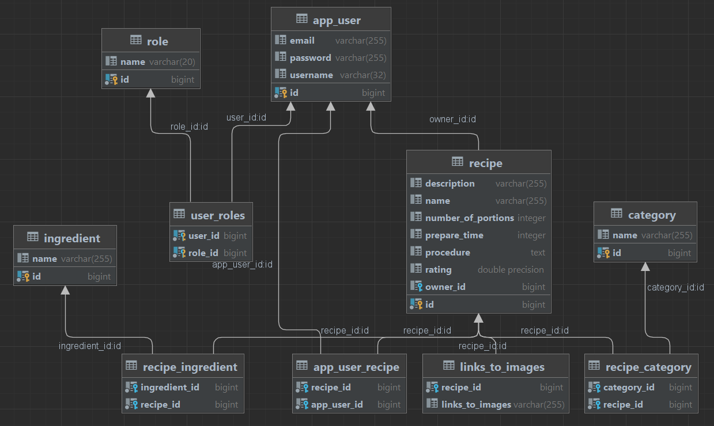

# Receptář - Backend

Aplikace slouží pro účely semestrální práce pro předmět NNPIA. Semestrální práce se skládá ze dvou částí.
Tato část slouží jako backend pro aplikaci, která má sloužit jako jakýsi receptář. Aplikace by měla umožnit
uživatelům vyhledávat recepty. Registrovaní a přihlášení uživatelé mají možnost přidávat nové recepty a
a také si je přidávat mezi své oblíbené recepty.

## Instalace

Dle zadání semestrální práce nebylo nutné nahrávat aplikaci na žádný server a proto aplikace běží jen lokálně. Ke spuštění
je potřeba spustit docker container s databází, backend a frontend.

## Použití

Aplikace vyžaduje přístup k některým endpointům pomocí tokenu JWT. Pokud je JWT validní, tak je přístup povolen,
pokud ne, je znemožněn a je vrácena chybová hláška.


Aplikace obsahuje tyto základní endpointy, které jsou pak ještě dělený pro samostantné operace, jako GET, POST, DELETE, UPDATE
 dle potřeby.

```http
/api/v1/users/
```
```http
/api/v1/role/
```
```http
/api/v1/auth/
```
```http
/api/v1/category/
```
```http
/api/v1/ingredient/
```
```http
/api/v1/recipe/
```
```http
/api/v1/test/
```

## Databáze

Semestrální práce používá databázi PostgreSQL. Vlastnosti databáze jsou uložený v souboru docker-compose.yaml.
Databáze obsahu 5 hlavních tabulek: *app_user, role, recipe, category, ingredient*.
<br>Obsahuje i další tabulky, které slouží jako spojovací nebo pomocné tabulky: *user_roles, recipe_ingredient, app_user_recipe,
links_to_images, recipe_category*

